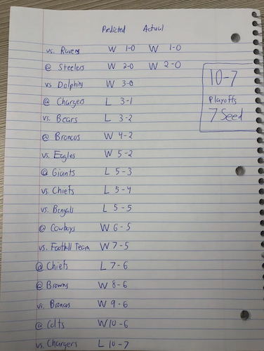
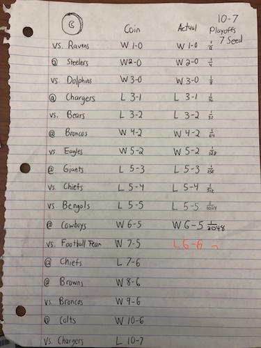

```{r setup, include=FALSE}
knitr::opts_chunk$set(echo = TRUE)
```

## Can a magic coin teach us about p-values?
*Adam Dickey October 2025*

**P-values** are everywhere in science and medicine.  As a first pass, the p-value is the probability (hence the "p" in p-value) that your data were observed, assuming the data were generated by chance.  A p-value is deemed “statistically significant” when it is very small – traditionally less than 0.05 (or 5%).  Statistically significant results are more likely to be published [@franco_publication_2014], which means scientists are incentivized to look for small p-values.  But p-values don’t mean what you think they mean, and you’re probably not calculating them right anyway.  To understand why, consider the curious case of a magic coin that predicted the Las Vegas Raiders’ football season.

Before the start of the 2021 NFL season, Reddit user **pongislame** [posted](https://www.reddit.com/r/raiders/comments/pupmwe/during_the_offseason_i_simulated_the_nfl_season/) a picture of a prediction: “During the off-season I simulated the NFL season by flipping a weighted coin based on game odds. So far accurate through two upset wins.”  This prediction later went viral after it predicted the first 11 games correctly.  [CBS Sports](https://www.cbssports.com/nfl/news/raiders-fans-coin-flip-has-correctly-predicted-result-of-every-las-vegas-game-this-season/) reported, “The Raiders' playoff push may depend on the flip of a Reddit user's magic coin.”  They quoted the blog [Fansided](https://fansided.com/betsided/posts/raiders-fate-this-season-lies-with-magic-coin-01fncsxwbrkx) as saying there was only a 0.05% chance (1 in 2048) of the coin predicting the first 11 games.  In other words, the probability of calling 11 coin flips in a row, assuming a fair coin, is 0.0005.  That is a p-value, and that value is much smaller than the traditional threshold of 0.05.  However, that p-value is exaggerated.  I argue that a better estimate is 0.28, well above 0.05. This story wouldn’t have gone viral if the lead touted “only a 28% chance!” But what is a p-value, and why is the reported value of 0.0005 wrong?


 

The **American Statistical Association** defines a p-value as “the probability under a specified statistical model that a statistical summary of the data would be equal to or more extreme than its observed value” [@wasserstein_asa_2016].  Typically, the “specified statistical model” is the null hypothesis that there is no effect.  When the p-value is small, we are taught to reject the null and accept the alternative.  In the Raiders example, the null hypothesis is the data were generated by a random coin flip. The alternative hypothesis seems to be the coin is magic and can predict the future. This procedure is called null hypothesis testing.  It is the dominant paradigm in the scientific and medical literature.  It is also problematic, unless you believe in magic coins.

In layman’s terms, the p-value is the chance of observing your data (or more extreme), assuming it is generated by chance (the null hypothesis). It is the probability of data given the null.  The p-value is not the probability that the data were due to chance [@wasserstein_asa_2016].  That is the probability of the null given the data.  Those two probabilities are very different.  The probability that you are Catholic given you are the pope is 1 out of 1, but the probability you are the pope given that you are Catholic is around 1 out of a billion. Transforming the first statement into the second requires something called Bayes’ rule (a topic for another essay). If you believe the author, then the chance the Raiders prediction was by a random process is 100%, because the methods described were that data were generated by “flipping a weighted coin.” 

Why is the reported p-value of 0.0005 too small?  The probability of guessing 11 coin flips is the same as flipping 11 heads in a row, which is 1 out of 2 raised to the 11th power: 1 in 2048, or a p-value of 0.0005 (0.05 % chance).  A pedantic point is that this is a one-tailed p-value, instead of a two-tailed p-value.  There are two ways to map a coin flip to wins and losses.  It would also be impressive if tails predicted 11 wins in a row, instead of heads. In this case, the two tailed p-value is the chance of 11 heads, or 11 tails, in a row.  That is 2 out of 2048, or a p-value of 0.001 (0.1 %).

However, there are three more critical issues that must be addressed to correctly calculate a one-tailed p-value: **1) optional stopping, 2) inappropriate null hypothesis**, and **3) multiple comparisons**.  Addressing all three issues leads to corrected one-tailed p-value of 0.28 (28%).  That means the reported p-value of 0.0005 is 500 times too small! 

#### 1) Optional stopping
Let’s explore the first issue: **optional stopping**. A-p-value is designed to assess the result of an experiment before it has been done.  This includes specifying a sample size.  In practice, sample size is usually an iterative process.  Collect data and compute a p-value.  If it’s less then 0.05, great, stop and publish.  If it doesn’t quite reach 0.05, then collect more data and try again.  That is optional stopping.  This stepwise computation of p-values leads to false positives [@rouder_optional_2014].  In this case, the viral p-value was computed after 11 games, but 17 games were actually predicted.  What happened the rest of the season?

 


In fact, the prediction failed on the 12th game, which means p-value computed from 11 games was the optimal time to stop.  Over the entire season, the coin predicted 15 of 17 games.  That is still impressive, but not quite magical.  To calculate the p-value for the data (15 of 17 correct predictions), we can use the binomial distribution.  That gives the chance of *n* heads out of *m* flips.  The p-value is the chance of 15, 16 or 17 heads out of 17 flips.  This can be done using commonly available statistic packages, such as **R**. This raises the p-value from 0.0005 to 0.001, or a 0.1% chance of the data, assuming the null.

```{r}
p1 <- sum(dbinom(15:17, size=17, prob=0.5)) 
print(p1,digits=2)
```


#### 2) Inappropriate null hypothesis

The second issue is an **inappropriate null hypothesis**.  In the calculations above, we assumed a fair coin, with an equal 50% chance of heads or tails.  However, that’s not how the data were generated.  **Pongislame** simulated a “weighted coin based on game odds.”  When the Raiders were predicted to win 60% of the time, then the coin also came up heads 60% of the time.  **Pongislame** didn't report the game odds that were used, but final prediction was a 10-7 season.  A good guess for the individual game probability is 10 of 17, or 59%.  We can also use the binomial distribution to predict getting 15 or more of heads out of 17 flips, assuming it comes up heads 59% of the time.  This again raises the p-value, from 0.001 to 0.01, or a 1% chance of the data assuming the null.

```{r}
p2 <- sum(dbinom(15:17, size=17, prob=0.59)) 
print(p2,digits=2)
```


#### 3) Multiple Comparisons
The third, and most important issue, is multiple comparisons.  **Pongislame** didn’t just predict the Raiders season.  They predicted the season for each of the 32 NFL teams.  The p-value should calculate the chance of calling 15 or more of 17 games for at least one of 32 teams. That probability is the 1 minus the probability of NOT calling 15 or more games (0.99), for every team.  That raises the p-value from 0.01 to 0.28, or a 28% chance of observing the data assuming the null hypothesis.

```{r}
p3 <- 1-.99^32
print(p3,digits=2)
```

The trouble with traditional null hypothesis testing is that you aren’t required to specify a clear alterative hypothesis.  Usually, there are many alternative hypothesis.  Here, the p-value of 0.0005 allows one to reject the null hypothesis that the 11 out of 11 games were predicted in advance, using a fair coin.  But we already know that hypothesis is incorrect.  We were told that a total of 544 games (17*32) were simulated using a weighted coin.

For example, suppose your think you hear a strange sound from the basement.  The null hypothesis is “there was no sound.”  The alternative hypothesis that comes to mind might be “there is monster in the basement.”  If you hear the sound again, that might allow you to reject the null, but that doesn’t mean there is a monster.  There are many alternative hypotheses, including "the radiator turned on."

This is not a trivial point. In medical literature, a common null hypothesis is “the drug has no effect,” and the alternative hypothesis “the drug is effective.”  But the ASA defined a p-value as a probability under a “specified statistical model.”  If that statistical model is wrong, you might successfully reject the null even if the drug is not effective.  For example, the commonly used Student’s t-test (for the difference of two means) assumes that the data follows a nice bell-shaped, normal (or Gaussian) distribution.  If the data are not normally distributed, you might reject the null, even if the drug tested is a sugar pill.  Rejecting the null doesn’t necessary that the alternative hypothesis you want is correct.

The next time you read about how a new drug cures cancer or Alzheimer’s disease, don’t just look at how small the p-value is.  Read the methods.  Was there optional stopping, or was the sample size pre-specified?  Is there more than one plausible alternative hypothesis?  Did they correct for multiple comparisons?  Just because a paper reports a tiny p-value doesn’t mean that the drug was effective. One group argued that "undisclosed flexibility in data collection and analysis allows presenting anything as significant" [@simmons_false-positive_2011]. That is, with enough statistical shenanigans, even a sugar pill can be made to look magical.

## Recommended Reading

* **Ritchie, Stuart. Science fictions**: How fraud, bias, negligence, and hype undermine the search for truth. Metropolitan Books, 2020.

* **Clayton, Aubrey. Bernoulli's fallacy**: Statistical illogic and the crisis of modern science. Columbia University Press, 2021.

 
## Bibliography